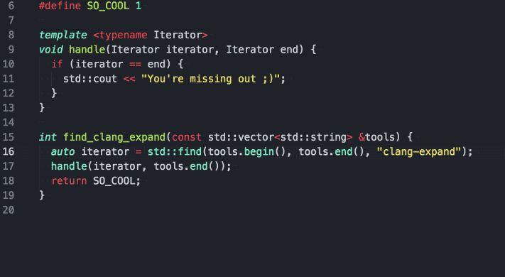

# :dragon: clang-expand

<p align="center">
  
  <br><br>
  A clang tool for happy refactoring without source-code gymnastics.
  <br><br>
     
</p>

## Overview

I recently overheard the following conversation on my way to work, that may seem familiar to you:

> __Gandalf__: It is important to refactor your code and keep functions concise and coherent.  
> __Harry Potter__: Yeah, sure, but I hate having to jump around between files to get the full picture of what my code is doing. One function = one place to look.  
> __Obi Wan Kenobi__: Use the force, Harry.  
> __Batman__: He means *clang-expand* :sparkles:

Inspired by Gandalf's words, I set out to find a solution to Harry's problem and
built *clang-expand*. Point it at a function invocation in your source code and
tell it where to look for stuff, and it will find the correct definition of that
particular (template) function, method, operator overload or even constructor
and "expand" it into the current scope. *Expanding* means it will:

1. Replace parameters with respective argument expressions. That is, for a
function `f(int x)` that you call with `f(5)`, clang-expand will rewrite every
occurrence of `x` inside `f` to `5`. Note that since clang-expand uses clang, it
actually understands C++ and knows what occurrences of `x` are parameter
references and what aren't. Default arguments are replaced as well.

<p align="center">
<table align="center">
<tr><th colspan="2">Given</th></tr>
<tr valign="top"><td colspan="2"><sub><pre lang="cpp">
template&lt;typename Range&gt;
void magic(Range& range, int meaning_of_life = 42) {
  auto iterator = std::find(range.begin(), range.end(), meaning_of_life);
  if (iterator != range.end()) {
    range.erase(iterator);
    std::cout << "Successfully erased all meaning of life\n";
  }
}
</pre></sub></td></tr>
<tr><th>Unexpanded</th><th>Expanded</th></tr>
<tr valign="top">
<td><sub><pre lang="cpp">
std::vector<int> v = {1, 42, 3};                                       &nbsp;
magic(v);
^
</pre></sub></td>
<td><sub><pre lang="cpp">
std::vector<int> v = {1, 42, 3};
auto iterator = std::find(v.begin(), v.end(), 42);
if (iterator != v.end()) {
  std::cout << "Successfully erased all meaning of life\n";
  v.erase(iterator);
}
</pre></sub></td>
</tr>
</table>
</p>

As you can see, clang-expand actually instantiated the template function during
the expansion. This is because on the level that it operates on within the clang
AST, semantic analysis, including template type deduction, are already complete.
This means that calling templates is not a problem for clang-expand.

2. If you're assigning the return value of a function you expand to a
variable, clang-expand will replace every `return` statement inside the function
with an assignment. It attempts to do this in a reasonably intelligent way,
constructing the variable with the return value directly if there is only one
`return` and else first declaring the variable and then assigning. The latter
only works if the type of the variable is default-constructible and clang-expand
will refuse to expand otherwise.

<table>
<tr><th colspan="2">Given</th></tr>
<tr valign="top"><td colspan="2"><sub><pre lang="cpp">
std::string concat(const std::string&amp; first, const std::string&amp; second) {
  return first + "-"s + second;
}
<br>
std::string concat(const std::string&amp; first, const std::string&amp; second, bool kebab) {
  if (kebab) {
    return first + "-"s + second;
  } else {
    return first + std::toupper(second.front(), {}) + second.substr(1);
  }
}
</pre></sub></td></tr>
<tr><th>Unexpanded</th><th>Expanded</th></tr>
<tr valign="top">
<td><sub><pre lang="cpp">
auto kebab = concat("clang", "expand");
             ^
</pre></sub></td>
<td><sub><pre lang="cpp">
std::string kebab = "clang" + "-"s + "expand";
</pre></sub></td>
</tr>
<tr><th>Unexpanded</th><th>Expanded</th></tr>
<tr valign="top">
<td><sub><pre lang="cpp">
auto maybeCamel = concat("clang", "expand", flipCoin());
                  ^
</pre></sub></td>
<td><sub><pre lang="cpp">
std::string maybeCamel;
if (flipCoin()) {
  maybeCamel = "clang" + "-"s + "expand";
} else {
  maybeCamel = "clang" + std::toupper("expand".front(), {}) + "expand".substr(1);
}
</pre></sub></td>
</tr>
</table>

3. If you're calling a method, clang-expand will prepend the base to every method or member of referenced inside:

<table>
<tr><th>Unexpanded</th><th>Expanded<sup><a href="#fn1">1</a></sup></th></tr>
<tr valign="top">
<td><sub><pre lang="cpp">
std::vector<int> my_vec;                                      &nbsp;
my_vec.emplace_back(42);
       ^
</pre></sub></td>
<td><sub><pre lang="cpp">
std::vector<int> my_vec;                                      &nbsp;
if (my_vec.__end_ < my_vec.__end_cap())
{
    __RAII_IncreaseAnnotator __annotator(*this);
    __alloc_traits::construct(my_vec.__alloc(),
                              _VSTD::__to_raw_pointer(my_vec.__end_),
                              _VSTD::forward<_Args>(42)...);
    __annotator.__done();
    ++my_vec.__end_;
}
else
    my_vec.__emplace_back_slow_path(_VSTD::forward<_Args>(42)...);
</pre></sub></td>
</tr>
</table>

<a name="fn1"><sup>1</sup></a> *This is the implementation on my system, of course.*

4. If the function you're expanding is an operator, clang-expand can handle that just as well:

<table>
<tr><th colspan="2">Given</th></tr>
<tr valign="top"><td colspan="2"><sub><pre lang="cpp">
struct by_lightning {
  bool operator==(const by_lightning& other) const noexcept {
    return this->circuit == other.circuit;
  }
  short circuit;
};
</pre></sub></td></tr>
<tr><th>Unexpanded</th><th>Expanded</th></tr>
<tr valign="top">
<td><sub><pre lang="cpp">
by_lightning first{1};                                         &nbsp;
by_lightning second{2};
return first == second;
             ^
</pre></sub></td>
<td><sub><pre lang="cpp">
by_lightning first{1};                                        &nbsp;
by_lightning second{2};
return first.circuit == other.circuit;
</pre></sub></td>
</tr>
</table>

5. Besides expanding functions that are real code, clang-expand can also expand
function-like and *even object-like* macros (that just `#define` something
without being parameterized):

<table>
<tr><th colspan="2">Given</th></tr>
<tr valign="top"><td colspan="2"><sub><pre lang="cpp">
#define MAX(a, b) (a) > (b) ? (a) : (b)
#define PI 3.14
</pre></sub></td></tr>
<tr><th>Unexpanded</th><th>Expanded</th></tr>
<tr valign="top">
<td><sub><pre lang="cpp">
double pi_if_a_greater_b(double a, double b) {                &nbsp;
  auto greater = MAX(a, b);
                 ^
  if (greater == a) {
    return PI;
           ^
  }
  return -1;
}
</pre></sub></td>
<td><sub><pre lang="cpp">
double pi_if_a_greater_b(double a, double b) {                        &nbsp;
  auto greater = (a) > (b) ? (a) : (b);
  if (greater == a) {
    return 3.14;
  }
  return -1;
}
</pre></sub></td>
</tr>
</table>

6. clang-expand not only performs substitution for function parameters, it can also substitute type and non-type template parameters! Voilà:

<table>
<tr><th colspan="2">Given</th></tr>
<tr valign="top"><td colspan="2"><sub><pre lang="cpp">
template &lt;typename Explicit, unsigned number, typename Deduced&gt;
auto my_template(Deduced deduced) {
  using Alias = Explicit;
  return deduced + static_cast&lt;Alias&gt;(number);
}
</pre></sub></td></tr>
<tr><th>Unexpanded</th><th>Expanded</th></tr>
<tr valign="top">
<td><sub><pre lang="cpp">
my_template&lt;float, 24&gt;(10);                                    &nbsp;
^
</pre></sub></td>
<td><sub><pre lang="cpp">
using Alias = float;
return 10 + static_cast&lt;Alias&gt;(24);                           &nbsp;
</pre></sub></td>
</tr>
</table>

## Usage

clang-expand is implemented as a command-line tool targeted at building editor integrations. The tool itself has the following help text (excerpt):

```
$ clang-expand -help
USAGE: clang-expand [options] <source0> [... <sourceN>]

OPTIONS:

clang-expand options:

  -call                      - Whether to return the source range of the call
  -column=<uint>             - The column number of the function to expand
  -declaration               - Whether to return the original declaration
  -definition                - Whether to return the original definition
  -file=<string>             - The source file of the function to expand
  -line=<uint>               - The line number of the function to expand
  -rewrite                   - Whether to generate the rewritten (expanded) definition
```

Basically, you have to pass it any sources you want the tool to look for
definitions in as positional arguments. The `-file`, `-line` and `-column`
options then determine the location of the call to expand. This position has to
be somewhere on the token you want to expand (i.e. not necessarily at the
beginning). The `-file` defaults to the first source if you omit the option.
Additionally, you have to pass any options required to compile the files at the
end, following `--`. For example, given:

`foo.h`:
```cpp
int foo();
```

`foo.cpp`:
```cpp
int foo() { return 42; }
```

`main.cpp`:
```cpp
#include "foo.h"
auto main() -> int {
  auto x = foo();
}
```

The following command would do the job:

```bash
$ clang-expand main.cpp foo.cpp -line=3 -column=14 -- -I/path/to/include -std=c++14
```

which will output:

```json
{
  "call": {
    "begin": {
      "column": 3,
      "line": 3
    },
    "end": {
      "column": 17,
      "line": 3
    }
  },
  "declaration": {
    "location": {
      "filename": "/path/to/foo.h",
      "offset": {
        "column": 5,
        "line": 1
      }
    },
    "name": "foo",
    "text": "int foo();"
  },
  "definition": {
    "location": {
      "filename": "/path/to/foo.cpp",
      "offset": {
        "column": 5,
        "line": 1
      }
    },
    "macro": false,
    "rewritten": "int x = 42;",
    "text": "int foo() { return 42; }"
  }
}
```

Yes, JSON! But why so much output? Well, since clang-expand has to find the
declaration and definition of a function you want to expand, it might as well
also return the location and full text for either (because why not). As such,
clang-expand can also be used as a backend for
"go-to-definition"/"show-declaration" functions inside a text editor (though an
indexed-solution like [ctags](https://en.wikipedia.org/wiki/Ctags) is likely
faster for just that).

For expanding, what's most interesting here is the `call` section and the
`definition.rewritten` field. The former is the entire range (defined by two
`(line, column)` pairs) in the source code that you'll want to replace with the
expansion. The latter is the text to insert instead.

Even though the overhead to grab information about the definition and
declaration is negligible compared to the entire operation, it may still be
beneficial to turn off retrieval of certain parts of what clang-expand outputs,
or you may simply not need some of the output. This is the case when you're only
interested in expanding for example, where you only need the `call` and
`definition` section. For this reason, the clang-expand tool takes boolean
`-call, -declaration, -definition` and `-rewrite` options. By default, these
flags are all set to `true`, i.e. all of these sections will be included. By
setting them to `-<option>=false`, you can turn them off, however. For example:

```bash
$ clang-expand main.cpp foo.cpp -line=3 -column=14 -declaration=false -definition=false -rewrite=false -- -I/path/to/include -std=c++14
```

outputs only the call range:

```json
{
  "call": {
    "begin": {
      "column": 3,
      "line": 3
    },
    "end": {
      "column": 17,
      "line": 3
    }
  }
}
```

### Example editor integration

As my preferred editor as of 23rd March 2017, 19:42 GMT is
[Atom](http://atom.io), I have implemented an example editor integration of
clang-expand for Atom:
[atom-clang-expand](https://github.com/goldsborough/atom-clang-expand). My
preferred editor may have changed by the end of the last sentence, so I may be
working on an integration for another editor.

I would be very happy to assist anyone in building an integration with Vim,
Emacs, Sublime or any other editor, so please reach out if you would like to
build one. Implementing just the expansion functionality is quite trivial, as
you just need to invoke clang-expand, parse its output and replace some text. I
have also implemented go-to-declaration/definition and
show-declaration/definition for my Atom package, but those are optional (though
arguably even easier to implement, as you just have to jump to another
location or show some text).

## Limitations

While clang-expand tries very hard to expand calls in way that produces
syntactically correct code, this just simply is not always possible without
impacting other features (such as readability of the expanded code). A simple
example is when you have a function taking a parameter and you pass a variable
called `x` as an argument. If `x` is already used for something else inside the
function, there will be a collision. This can be detected in clang-expand -- no
problem -- and solved by mangling the name somehow (e.g. appending `_expanded`).
However, this reduces the readability of the produced expansion and is therefore
not done. Note that this means clang-expand will generally not work well with
recursive functions.

The bottom line is that the produced code will not always be valid, but you'll
most likely not care, since you probably just want to see what the code would
look like "more or less". Nevertheless, this is something where clang-expand
could be improved in the future.

## Building

If you just want to use clang-expand, you can grab the executable from the
[Release](https://github.com/goldsborough/clang-expand/releases) page.

To build from source, clang-expand uses cmake and requires a C++14-capable compiler.
It also depends on the full [LLVM](https://github.com/llvm-mirror/llvm) and
[clang](https://github.com/llvm-mirror/clang) source, so you will need to download
those, as explained [here](http://llvm.org/docs/GettingStarted.html#for-developers-to-work-with-a-git-monorepo).
If you're a moral person, you'll compile a tool that starts with the word "clang" with the aptly
named compiler. However, we do have support for unorthodox (gcc/msvc) folks. Just make sure you compile
the LLVM and clang libraries with the same compiler and standard library as you do clang-expand.

Once you have all that, you can build with:

```bash
$ mkdir build && cd build
$ cmake -DLLVM_PATH=/path/to/llvm/ -DFIND_LLVM_VERBOSE_CONFIG=on ..
```

### Docker

We provide Dockerfiles for Debian, Ubuntu, Fedora and OpenSUSE based images that, once built, have LLVM and clang libraries installed and compiled and contain build scripts to compile the project inside the Docker containers. While this is mainly to make it easier to create reproducible, fast and isolated releases of clang-expand on each of these distributions, these containers may actually be the easiest way for you to compile the project and make changes to it. To build a single container, run something like:

```sh
$ docker build --compress --memory 2G --tag clang-expand:<os> --file docker/<os>.Dockerfile
```

where `os` is in `{ubuntu, debian, fedora, opensuse}`. You can also pull the image from the [Docker Cloud](http://cloud.docker.com/app/goldsborough/repository/docker/goldsborough/clang-expand/):

```sh
$ docker pull goldsborough/clang-expand:<os>-latest
```

To then build the project inside the container, you can run:

```sh
$ docker run -v build:/home/build -v llvm-build:/llvm/build -v $PWD:/home/project -v $PWD/bin:/home/build/bin clang-expand:<os> ./build.sh <os>
```

where `os` is again one of the above. To explain the volumes we are mounting here:

1. The named volume `build` is where the project will be built with cmake,
2. The named volume `llvm-build` is where LLVM and clang will be built with cmake,
3. `$PWD:/home/clang-expand` mounts your local clang-expand directory under /home,
4. `$PWD/bin:/home/build/bin` is where all the binaries go. Mount it on the host if you want to keep the binaries.

You can also just run `docker-compose up` (provided you have `docker-compose` installed) from the project root to build clang-expand on all distributions. Our cmake also has a docker target, so `make docker` does the same as `docker-compose up`.

### Windows

On Windows, you'll want to use cmake-gui and let it generate a solution for Visual Studio 2017 (make sure `llvm-config` is either in the `PATH` or set the variable manually). Depending on how you've built LLVM you could have to add `mincore.lib` as an additional library dependency to the clang-generate project to fix some undefined external symbols.

## Documentation

clang-expand has very extensive in-source documentation which can be generated
with [Doxygen](http://www.doxygen.org). Run `make docs` inside the `build`
folder. You don't need to compile the project for this, just run `cmake ..` and
then `make` the `docs` target.

## License

This project is released under the [MIT
License](http://goldsborough.mit-license.org). For more information, see the
`LICENSE` file.

## Authors

[Peter Goldsborough](http://goldsborough.me) + [cat](https://goo.gl/IpUmJn)
:heart:
